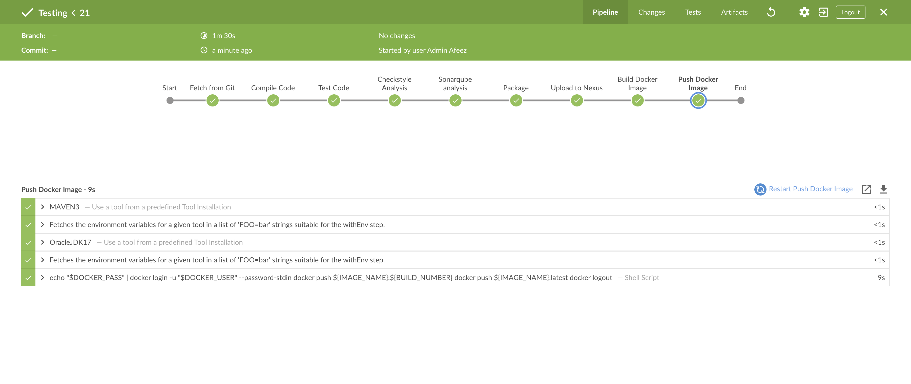
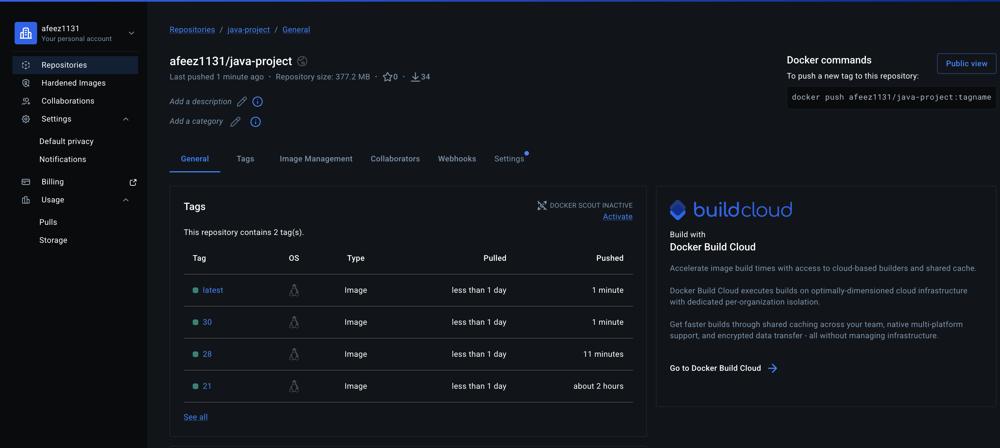
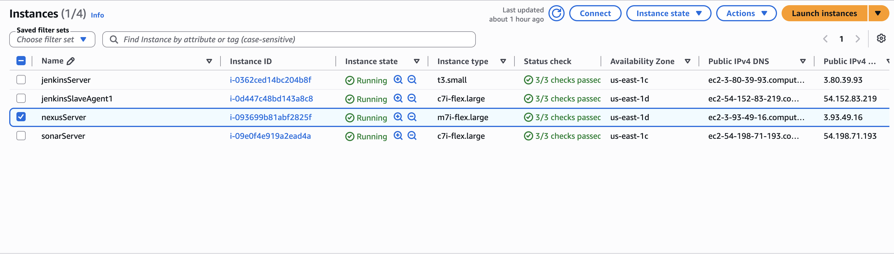

# Java CI/CD Pipeline — Jenkins, SonarQube, Nexus, Docker Hub

A production-grade CI/CD pipeline for a Java web application.

Every push to the repository triggers a full automated pipeline: compile, test, static analysis, artifact storage, Docker build, and registry push — orchestrated by Jenkins across a distributed controller/agent setup on AWS EC2.

---

## Architecture

```
Developer
    │
    ▼ Git Push
GitHub → Webhook
    │
    ▼
Jenkins Controller (t3.small)
    │
    └── SSH → Jenkins Agent (c7i-flex.large)
                │
                ├── Fetch from Git
                ├── Compile (Maven)
                ├── Unit Tests
                ├── Checkstyle Analysis
                ├── SonarQube Analysis
                ├── Package WAR
                ├── Upload to Nexus
                ├── Build Docker Image
                └── Push to Docker Hub
```

The controller stays lightweight — it orchestrates only. All build execution happens on the dedicated agent (`slave-agent`).

---

## Infrastructure

| Component      | Instance Type    | Role                          |
| -------------- | ---------------- | ----------------------------- |
| Jenkins Server | t3.small         | Pipeline orchestration        |
| Jenkins Agent  | c7i-flex.large   | Build execution               |
| Nexus Server   | m7i-flex.large   | WAR artifact storage          |
| SonarQube      | c7i-flex.large   | Static code analysis          |
| Docker Hub     | External (hosted)| Container image registry      |
| GitHub         | External (hosted)| Source code + webhook trigger |

---

## Pipeline Stages

### 1. Fetch from Git
Checks out the `main` branch from GitHub.

### 2. Compile
```bash
mvn clean compile
```

### 3. Test
```bash
mvn test
```

### 4. Checkstyle Analysis
```bash
mvn checkstyle:checkstyle
```

### 5. SonarQube Analysis
Uses SonarQube Scanner 4.7 with the following metrics:
- Bugs & vulnerabilities
- Code smells & maintainability
- Test coverage (JaCoCo)
- Checkstyle report integration
- Duplicated code

```bash
sonar-scanner \
  -Dsonar.projectKey=java-project \
  -Dsonar.sources=src/ \
  -Dsonar.java.binaries=target/test-classes/... \
  -Dsonar.jacoco.reportsPath=target/jacoco.exec \
  -Dsonar.java.checkstyle.reportPaths=target/checkstyle-result.xml
```

### 6. Package
```bash
mvn package
# Output: target/vprofile-v2.war
```

### 7. Upload to Nexus
Publishes the WAR to a hosted Nexus 3 repository over HTTP.

Artifact versioning uses build ID + sanitized timestamp:
```
com.visualpathit:java-project:<BUILD_ID>-<BUILD_TIMESTAMP>
```
Example: `com.visualpathit:java-project:25-26-06-26_11_21`

Repository: `java-project` at `172.31.40.220:8081`

### 8. Build Docker Image
```bash
docker build \
  -t afeez1131/java-project:${BUILD_NUMBER} \
  -t afeez1131/java-project:latest .
```

### 9. Push Docker Image
Authenticates via Jenkins credentials, pushes both tags, then logs out:
```bash
echo "$DOCKER_PASS" | docker login -u "$DOCKER_USER" --password-stdin
docker push afeez1131/java-project:${BUILD_NUMBER}
docker push afeez1131/java-project:latest
docker logout
```

---

## GitHub Webhook

Every push to `main` triggers the pipeline automatically.

```
Webhook URL: http://<jenkins-server>/github-webhook/
```

No SCM polling. No manual triggers. Push → pipeline.

---

## Jenkins Configuration

**Tools configured on agent:**
- OracleJDK 17
- Maven 3 (`MAVEN3`)
- SonarQube Scanner 4.7 (`sonar4.7`)
- Docker

**Credentials stored in Jenkins:**
- `dockerHubCredential` — Docker Hub (image push)
- `NexusCredentials` — Nexus (artifact upload)
- SSH key — agent connection

**SonarQube server:** configured as `sonar` in Jenkins global settings.

---

## Repository Structure

```
.
├── Jenkinsfile
├── Dockerfile
├── pom.xml
├── src/
├── target/
└── README.md
```

---

## Running Locally

```bash
git clone https://github.com/Afeez1131/java-project.git

mvn clean compile
mvn test
mvn clean package

docker build -t java-project .
docker run -p 8080:8080 java-project
```

---

## Slack Notifications

The pipeline posts to the `#jenkins` Slack channel after every run.

| Result  | Color  | Message                                      |
| ------- | ------ | -------------------------------------------- |
| Success | green  | `Pipeline succeeded: <job> #<build> (<url>)` |
| Failure | red    | `Pipeline FAILED: <job> #<build> (<url>)`    |

Configured via the Jenkins Slack Notification plugin using a pipeline-level `post` block — so notifications fire regardless of which stage passes or fails.

---

## What's Next

- Kubernetes deployment (EKS)
- Blue-green deployment strategy
- Trivy container image scanning
- OWASP Dependency Check
- Terraform for infrastructure provisioning
- Ansible for configuration management
- Automated rollback strategy

---
## Images
## Pipeline Screenshots

### Successful Pipeline Run (Build #21)


### Docker Hub — Published Tags


### AWS EC2 Infrastructure


## Author

**Afeez Lawal** — Backend & DevOps Engineer

- GitHub: [Afeez1131](https://github.com/Afeez1131)
- LinkedIn: [lawal-afeez](https://www.linkedin.com/in/lawal-afeez/)
